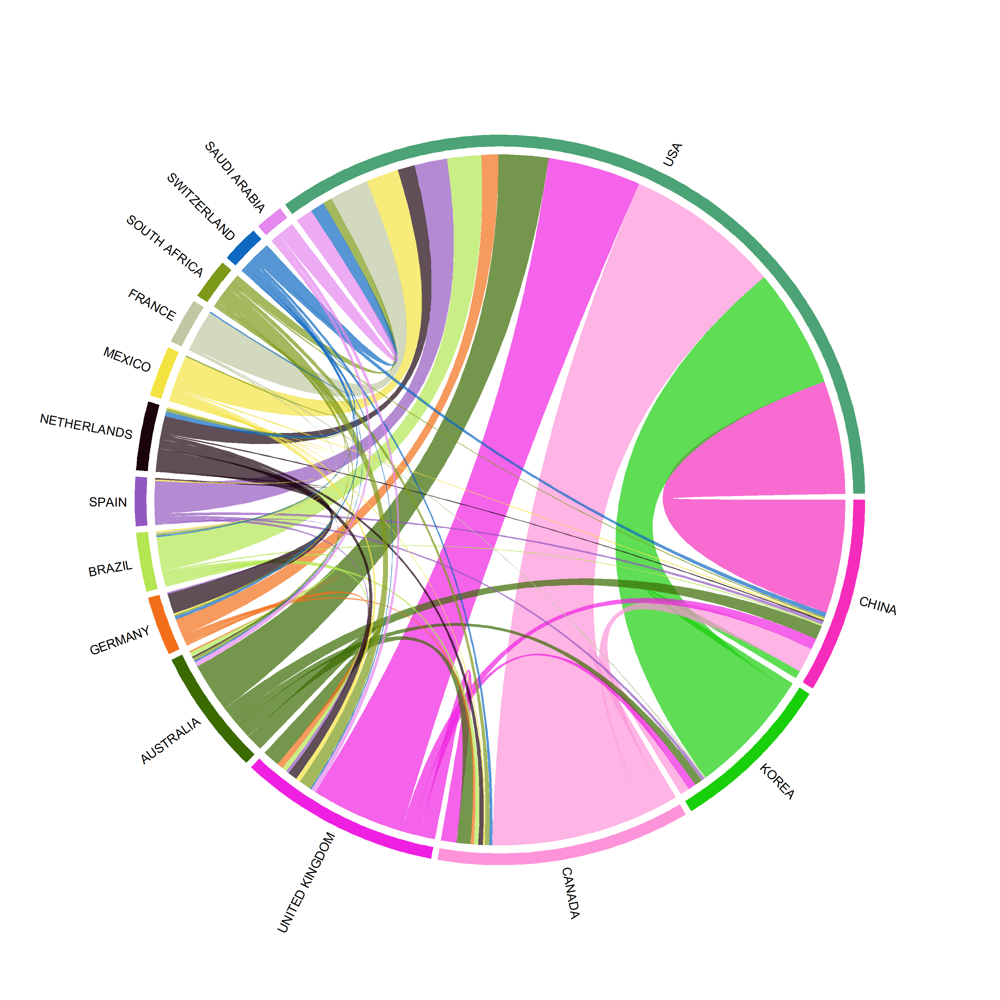

The following sets knitr options (caching, figure paths, and figure size), and creates the `figures` directory.

```{r setup, include = FALSE}
knitr::opts_chunk$set(
  echo = TRUE,
  message = FALSE,
  warning = FALSE,
  fig.width = 10,
  fig.height = 7,
  fig.align = "center",
  dpi = 300,
  dev = "png",
  fig.path = "figures/",
  cache = TRUE,
  cache.lazy = FALSE
)
# Create figures directory if it does not exist
if (!dir.exists("figures")) dir.create("figures", recursive = TRUE)
```

The following chunk loads required R packages and installs any that are missing.

```{r load-packages}
# Load required packages; install if missing
required <- c("bibliometrix", "ggplot2", "dplyr", "tidyr", "stringr", "viridis", "tibble", "Matrix", "circlize", "plotly", "htmlwidgets", "riverplot", "ggalluvial", "patchwork", "sf", "rnaturalearth", "countrycode")
for (pkg in required) {
  if (!requireNamespace(pkg, quietly = TRUE)) install.packages(pkg, repos = "https://cloud.r-project.org")
  library(pkg, character.only = TRUE)
}
```

We read and merge all Web of Science plain-text export files from the `data_wos` folder.

```{r read-and-merge-wos}
# ---------------------------------------------------------------------------
# Read and merge all Web of Science Plain Text files from data_wos/
# Uses relative path: data_wos/
# convert2df() accepts multiple files and merges them (duplicates removed later)
# ---------------------------------------------------------------------------
wos_dir <- "data_wos"
txt_files <- list.files(wos_dir, pattern = "\\.txt$", full.names = TRUE)
if (length(txt_files) == 0) stop("No .txt files found in ", wos_dir)

# Convert all files in one call (bibliometrix reads and merges)
M_raw <- convert2df(file = txt_files, dbsource = "wos", format = "plaintext")
n_identified <- nrow(M_raw)
```

We restrict the dataset to Article and Review document types only.

```{r document-type-restriction}
# Document type: keep only Article and Review (if DT field exists)
if ("DT" %in% names(M_raw)) {
  M_raw <- M_raw %>% filter(toupper(trimws(as.character(DT))) %in% c("ARTICLE", "REVIEW"))
} else {
  message("DT (document type) column not found; skipping document type filter.")
}
n_after_doc_type <- nrow(M_raw)
n_removed_doc_type <- n_identified - n_after_doc_type
```

Duplicate records are removed by DOI first, then by title for records without DOI.

```{r deduplication}
# Deduplicate: first by DOI, then by Title where DOI is missing
M_raw$has_doi <- !is.na(M_raw$DI) & trimws(M_raw$DI) != ""
# By DOI
M_dedup <- M_raw %>% filter(has_doi) %>% distinct(DI, .keep_all = TRUE)
no_doi <- M_raw %>% filter(!has_doi)
# By Title among those without DOI
no_doi <- no_doi %>% distinct(TI, .keep_all = TRUE)
M_dedup <- bind_rows(M_dedup, no_doi)
n_after_dedup <- nrow(M_dedup)
n_removed_dedup <- n_after_doc_type - n_after_dedup
```

Records with publication year after 2025 or without an abstract are excluded.

```{r year-and-abstract-filter}
# Remove publication year > 2025 and records without abstract
M_dedup$PY <- as.numeric(as.character(M_dedup$PY))
M_clean <- M_dedup %>% filter(!is.na(PY), PY <= 2025)
n_after_year <- nrow(M_clean)
n_removed_year <- n_after_dedup - n_after_year

# Remove records without abstract
M_clean <- M_clean %>% filter(!is.na(AB) & trimws(AB) != "")
n_final <- nrow(M_clean)
n_removed_abstract <- n_after_year - n_final
```

The following table summarizes the number of records at each selection stage.

```{r summary-table}
# Summary table for manuscript
summary_df <- data.frame(
  Stage = c(
    "Records identified (Web of Science)",
    "After document type restriction (Article/Review)",
    "After duplicate removal (DOI, then Title)",
    "After year correction (PY $\\leq$ 2025) and early access removal",
    "Final records included (after removing records without abstract)"
  ),
  N = c(n_identified, n_after_doc_type, n_after_dedup, n_after_year, n_final)
)
knitr::kable(summary_df, col.names = c("Stage", "N"), align = c("l", "r"))
```

The cleaned dataset is assigned to `M`, and author country (AU_CO) and institution (AU_UN) fields are extracted for later network analyses.

```{r assign-M}
# Use cleaned data for all subsequent analyses; extract fields needed for networks
M <- M_clean
M <- metaTagExtraction(M, Field = "AU_CO", sep = ";")
M <- metaTagExtraction(M, Field = "AU_UN", sep = ";")
results <- biblioAnalysis(M, sep = ";")
```

## Descriptive Performance Analysis

Annual publication counts by year are computed and plotted with a LOESS trend line.

```{r annual-production, fig.cap = "Annual scientific production (pediatric NHANES research)."}
# Annual scientific production with trend line (following reference style)
prod_df <- as.data.frame(table(PY = M$PY))
names(prod_df) <- c("Year", "Count")
prod_df$Year <- as.numeric(as.character(prod_df$Year))
prod_df <- prod_df %>% filter(!is.na(Year)) %>% arrange(Year)
plt_prod <- ggplot(prod_df, aes(x = Year, y = Count)) +
  geom_col(fill = "#2C7BB6", alpha = 0.85, width = 0.7) +
  geom_smooth(method = "loess", se = TRUE, colour = "#D7191C", linewidth = 1.2) +
  geom_text(aes(label = Count), vjust = -0.5, size = 2.8, colour = "grey30") +
  labs(x = "Publication year", y = "Number of publications", title = "Annual publication trend") +
  theme_minimal(base_size = 12) +
  theme(plot.title = element_text(face = "bold", hjust = 0.5), axis.text.x = element_text(angle = 45, hjust = 1), panel.grid.minor = element_blank())
ggsave("figures/01_annual_publication_trend.png", plt_prod, width = 10, height = 7, dpi = 300)
plt_prod
```

The next table lists the top 15 authors by publication count.

```{r top-authors}
# Most productive authors (table only)
auth_tb <- sort(table(unlist(strsplit(M$AU, ";"))), decreasing = TRUE)
auth_df <- data.frame(Author = names(auth_tb), Publications = as.integer(auth_tb), row.names = NULL)
knitr::kable(head(auth_df, 15), align = c("l", "r"), caption = "Top 15 authors by publication count")
```

The top 20 journals are tabulated and plotted as a bar chart.

```{r top-journals}
# Most productive journals (bar plot and table)
tb <- table(M$SO)
tb <- sort(tb, decreasing = TRUE)
top_j <- head(tb, 20)
df_j <- data.frame(Journal = names(top_j), Publications = as.integer(top_j), row.names = NULL)
knitr::kable(df_j, align = c("l", "r"), caption = "Top 20 journals by publication count")
p_j <- ggplot(df_j, aes(x = reorder(Journal, Publications), y = Publications, fill = Publications)) +
  geom_col() + coord_flip() + scale_fill_viridis_c(option = "viridis") +
  labs(x = "", y = "Number of publications", title = "Top 20 journals") +
  theme_minimal(base_size = 11) +
  theme(plot.title = element_text(hjust = 0.5))
ggsave("figures/03_top_journals.png", p_j, width = 10, height = 7, dpi = 300)
p_j
```

The top 15 institutions by publication count are listed.

```{r top-institutions}
# Most productive institutions
affils <- metaTagExtraction(M, Field = "AU_UN", sep = ";")
affils <- affils %>% filter(!is.na(AU_UN))
inst_tb <- sort(table(unlist(strsplit(affils$AU_UN, ";"))), decreasing = TRUE)
inst_df <- data.frame(Institution = names(inst_tb), Publications = as.integer(inst_tb), row.names = NULL)
knitr::kable(head(inst_df, 15), align = c("l", "r"), caption = "Top 15 institutions by publication count")
```

The top 15 countries by author-country affiliations are listed.

```{r top-countries}
# Most productive countries (by author-country affiliations; one paper can contribute multiple times)
M_country <- metaTagExtraction(M, Field = "AU_CO", sep = ";")
country_tb <- sort(table(unlist(strsplit(M_country$AU_CO, ";"))), decreasing = TRUE)
country_df <- data.frame(Country = names(country_tb), `Author-country affiliations` = as.integer(country_tb), row.names = NULL)
knitr::kable(head(country_df, 15), align = c("l", "r"), caption = "Top 15 countries by author-country affiliations (each paper counted once per author per country).")
```

A choropleth map shows the global distribution of documents by country.

```{r country-map, fig.cap = "Country scientific production map: number of documents per country (author-country affiliations, 1996-2025).", fig.width = 12, fig.height = 7}
tryCatch({
  # Top 15 countries from Table 2 (pediatric NHANES research 1996-2025)
  doc_df <- data.frame(
    Country = c("USA", "China", "Korea", "Canada", "United Kingdom", "Australia", "Germany", "Brazil", "Spain", "Argentina", "Iran", "Italy", "South Africa", "France", "Mexico"),
    Documents = c(9019L, 1908L, 1707L, 352L, 174L, 136L, 105L, 95L, 83L, 65L, 49L, 48L, 47L, 45L, 44L),
    stringsAsFactors = FALSE
  )
  # Map country names to ISO3 (manual for USA, Korea, United Kingdom)
  name_to_iso3 <- c(USA = "USA", Korea = "KOR", "United Kingdom" = "GBR")
  doc_df$iso_a3 <- name_to_iso3[doc_df$Country]
  idx <- is.na(doc_df$iso_a3)
  doc_df$iso_a3[idx] <- countrycode::countrycode(doc_df$Country[idx], origin = "country.name", destination = "iso3c", warn = FALSE)
  doc_df <- doc_df %>% filter(!is.na(iso_a3))
  # Breaks: <50, 50-100, 100-500, >500 (avoids empty 500-1000 band)
  doc_df$Category <- cut(doc_df$Documents,
    breaks = c(-Inf, 50, 100, 500, Inf),
    labels = c("<50", "50-100", "100-500", ">500"),
    include.lowest = TRUE)
  world <- rnaturalearth::ne_countries(scale = "small", returnclass = "sf")
  world <- world %>% filter(!is.na(iso_a3), admin != "Antarctica")
  world <- world %>% left_join(doc_df %>% select(iso_a3, Documents, Category), by = "iso_a3")
  world$Category <- factor(world$Category, levels = c("<50", "50-100", "100-500", ">500"))
  world$Category[is.na(world$Category)] <- "<50"
  world$Category <- factor(world$Category, levels = c("<50", "50-100", "100-500", ">500"))
  pal <- c("<50" = "#C6DBEF", "50-100" = "#6BAED6", "100-500" = "#2171B5", ">500" = "#D7301F")
  p_map <- ggplot(world) +
    geom_sf(aes(fill = Category), colour = "grey70", linewidth = 0.2) +
    scale_fill_manual(values = pal, name = "Author-country affiliations", drop = FALSE) +
    theme_void() +
    theme(legend.position = c(0.12, 0.25), legend.title = element_text(face = "bold"))
  ggsave("figures/04_country_map.png", p_map, width = 12, height = 7, dpi = 300)
  p_map
}, error = function(e) {
  message("Country map: ", e$message)
  if (!requireNamespace("sf", quietly = TRUE)) message("Install: install.packages('sf')")
  if (!requireNamespace("rnaturalearth", quietly = TRUE)) message("Install: install.packages('rnaturalearth')")
  if (!requireNamespace("countrycode", quietly = TRUE)) message("Install: install.packages('countrycode')")
})
```

The top 10 most cited articles (global citation count) are extracted from the cited-references field and tabulated.

```{r citation-analysis}
# Global citation: CR$Cited is a table (named vector), not a data.frame; build table and show top 10 only
tryCatch({
  CR <- citations(M, field = "article", sep = ";")
  if (is.null(CR$Cited) || (length(CR$Cited) == 0)) {
    knitr::kable(data.frame(Message = "No citation data available."), caption = "Top 10 cited articles (global)")
  } else {
    # Coerce table to data.frame: Cited = ref string, Times_Cited = count; add Year/Source/DOI if present
    n <- length(CR$Cited)
    df_cited <- data.frame(
      Cited = names(CR$Cited),
      Times_Cited = as.vector(CR$Cited),
      stringsAsFactors = FALSE
    )
    if (!is.null(CR$Year) && length(CR$Year) >= n) df_cited$Year <- CR$Year
    if (!is.null(CR$Source) && length(CR$Source) >= n) df_cited$Source <- CR$Source
    # Extract DOI from Cited string (WoS format: "DOI 10.xxxx/xxxx" or "10.xxxx/xxxx")
    df_cited$DOI <- stringr::str_extract(df_cited$Cited, "10\\.\\d{4,}/[^\\s,;\\]\\)]+")
    top10 <- head(df_cited, 10)
    align <- c("l", "r", "r", "l", "l")[seq_len(ncol(top10))]
    knitr::kable(top10, caption = "Top 10 cited articles (global)", align = align)
  }
}, error = function(e) message("Citation extraction: ", e$message))
```

## Collaboration Networks

Country collaboration is visualized as a chord diagram (top 15 countries).

```{r country-collaboration, fig.cap = "Country collaboration (chord diagram).", out.width = "90%"}
# Country collaboration as chord diagram; custom label track to avoid overlapping names
tryCatch({
  net_collab <- biblioNetwork(M, analysis = "collaboration", network = "countries", sep = ";")
  mat <- as.matrix(net_collab)
  n_top <- 15
  if (nrow(mat) > n_top) {
    total <- rowSums(mat, na.rm = TRUE) + colSums(mat, na.rm = TRUE)
    top_idx <- order(total, decreasing = TRUE)[seq_len(n_top)]
    mat <- mat[top_idx, top_idx, drop = FALSE]
  }
  diag(mat) <- 0
  png("figures/05_country_collaboration.png", width = 10, height = 10, units = "in", res = 300)
  par(mar = c(1, 1, 1, 1))
  circlize::circos.par(canvas.xlim = c(-1.12, 1.12), canvas.ylim = c(-1.12, 1.12))
  circlize::chordDiagram(mat, symmetric = TRUE, annotationTrack = "grid", transparency = 0.3,
    preAllocateTracks = list(track.height = circlize::mm_h(5)))
  circlize::circos.track(track.index = 1, panel.fun = function(x, y) {
    circlize::circos.text(circlize::CELL_META$xcenter, circlize::CELL_META$ylim[1],
      circlize::CELL_META$sector.index, facing = "clockwise", niceFacing = TRUE,
      adj = c(0, 0.5), cex = 0.75)
  }, bg.border = NA)
  circos.clear()
  dev.off()
  
}, error = function(e) {
  message("Country collaboration: ", e$message)
  if (!requireNamespace("circlize", quietly = TRUE)) message("Install the circlize package: install.packages('circlize')")
})
```

Institutional collaboration is visualized as a network (nodes = institutions, edges = co-authorship).

```{r institution-collaboration, fig.cap = "Institutional collaboration network."}
# Institution collaboration as network (nodes = institutions, edges = collaboration)
tryCatch({
  net_inst <- biblioNetwork(M, analysis = "collaboration", network = "universities", sep = ";")
  png("figures/06_institution_collaboration.png", width = 10, height = 7, units = "in", res = 300)
  networkPlot(net_inst, n = 40, type = "fruchterman", size = TRUE, size.cex = TRUE,
    labelsize = 0.6, edgesize = 2, edges.min = 3)
  dev.off()
  networkPlot(net_inst, n = 40, type = "fruchterman", size = TRUE, size.cex = TRUE,
    labelsize = 0.6, edgesize = 2, edges.min = 3)
}, error = function(e) message("Institution collaboration: ", e$message))
```


## Keyword Co-occurrence Network

A keyword co-occurrence network is built from Keywords Plus (or author keywords) and plotted.

```{r keyword-cooccurrence, fig.cap = "Keyword co-occurrence network (Keywords Plus; association-normalized)."}
# Keyword co-occurrence: use ID (Keywords Plus) or DE (Author Keywords); avoid empty matrix
M_kw <- M
M_kw$ID <- trimws(as.character(M_kw$ID))
M_kw$DE <- trimws(as.character(M_kw$DE))
M_kw$ID[is.na(M_kw$ID) | M_kw$ID == ""] <- ""
M_kw$DE[is.na(M_kw$DE) | M_kw$DE == ""] <- ""
use_field <- "ID"
if (sum(nchar(M_kw$ID)) < 100) use_field <- "DE"
M_kw <- M_kw %>% filter(nchar(get(use_field)) > 0)
if (nrow(M_kw) < 10) { M_kw <- M %>% filter(nchar(trimws(tidyr::replace_na(as.character(DE), ""))) > 0); use_field <- "DE" }
if (use_field == "DE" && "DE" %in% names(M_kw)) M_kw$ID <- M_kw$DE
tryCatch({
  K <- biblioNetwork(M_kw, analysis = "co-occurrences", network = "keywords", sep = ";")
  if (length(dim(K)) >= 2 && ncol(K) > 0 && nrow(K) > 0) {
    n_show <- min(40, ncol(K))
    png("figures/07_keyword_cooccurrence.png", width = 10, height = 7, units = "in", res = 300)
    networkPlot(K, normalize = "association", n = n_show, type = "fruchterman", size = TRUE, size.cex = TRUE, labelsize = 0.7, edgesize = 3, edges.min = 3)
    dev.off()
    networkPlot(K, normalize = "association", n = n_show, type = "fruchterman", size = TRUE, size.cex = TRUE, labelsize = 0.7, edgesize = 3, edges.min = 3)
  } else message("Keyword matrix too small or invalid; skipping network plot.")
}, error = function(e) {
  message("Keyword co-occurrence error: ", e$message)
})
```

```{r thematic-map-clean, fig.cap = "Thematic map (Author Keywords, cleaned): centrality vs density."}
# Remove generic/metadata/NHANES terms before clustering
generic_terms <- c("children", "child", "pediatric", "pediatrics", "adolescents", "adolescent",
  "united states", "usa", "nhanes", "nhanes iii", "national health", "national-health",
  "3rd national-health", "national health and nutrition examination survey",
  "national health and nutrition examination surveys",
  "prevalence", "study", "survey", "surveys", "cross-sectional", "cross-sectional study",
  "cross-sectional studies", "examination survey", "nutrition examination",
  "health and nutrition", "national health and nutrition",
  "population", "risk-factors", "risk factors",
  "epidemiology", "association", "exposure", "age", "sex", "gender",
  "women", "men", "adults", "health", "public health", "body-mass index",
  "humans", "male", "female",
  "blacks", "hispanics", "race", "racial", "ethnic", "ethnicity",
  "national health and nutrition examination survey", "third national health")
M_tm <- M
for (fld in c("DE", "ID")) {
  if (fld %in% names(M_tm)) {
    M_tm[[fld]] <- sapply(M_tm[[fld]], function(kw) {
      if (is.na(kw) || kw == "") return(kw)
      terms <- trimws(unlist(strsplit(kw, ";")))
      terms <- terms[!tolower(terms) %in% generic_terms]
      if (length(terms) == 0) return("")
      paste(terms, collapse = ";")
    })
  }
}
tryCatch({
  thematic_map <- thematicMap(M_tm, field = "DE", n = 250, minfreq = 15, stemming = FALSE, size = 0.5, n.labels = 3, repel = TRUE)
  print(thematic_map$map)
  ggsave("figures/08_thematic_map.png", plot = thematic_map$map, width = 10, height = 7, dpi = 300)
}, error = function(e) message("Thematic map: ", e$message))
```

Thematic maps by period (1996–2005, 2006–2015, 2016–2025) are combined into a single three-panel figure showing how research themes shift over time.

```{r thematic-map-by-period, fig.cap = "Thematic maps by period (A: 1996-2005, B: 2006-2015, C: 2016-2025).", fig.width = 18, fig.height = 7}
if (!"PY_num" %in% names(M_tm)) M_tm$PY_num <- as.numeric(as.character(M_tm$PY))
period_slices <- list("A: 1996-2005" = 1996:2005, "B: 2006-2015" = 2006:2015, "C: 2016-2025" = 2016:2025)
tm_plots <- list()
tm_clusters <- list()
for (pname in names(period_slices)) {
  M_slice <- M_tm[M_tm$PY_num %in% period_slices[[pname]], ]
  if (nrow(M_slice) < 30) {
    message("Period ", pname, ": only ", nrow(M_slice), " papers; skipping.")
    next
  }
  tryCatch({
    tm <- thematicMap(M_slice, field = "DE", n = 200, minfreq = 5, stemming = FALSE, size = 0.6, n.labels = 2, repel = TRUE)
    tm$map <- tm$map + ggtitle(pname) + theme(plot.title = element_text(hjust = 0.5, face = "bold", size = 11))
    tm_plots[[pname]] <- tm$map
    fname <- paste0("figures/08_thematic_map_", gsub("[^0-9]", "_", pname), ".png")
    ggsave(fname, plot = tm$map, width = 10, height = 7, dpi = 300)
    # Extract cluster info for summary table
    if (!is.null(tm$clusters)) {
      cl <- tm$clusters
      cl$Period <- pname
      tm_clusters[[pname]] <- cl
    }
  }, error = function(e) message("Thematic map (", pname, "): ", e$message))
}
# Harmonize axis scales across all three panels
if (length(tm_plots) == 3) {
  all_builds <- lapply(tm_plots, ggplot_build)
  x_min <- min(sapply(all_builds, function(b) b$layout$panel_scales_x[[1]]$range$range[1]))
  x_max <- max(sapply(all_builds, function(b) b$layout$panel_scales_x[[1]]$range$range[2]))
  y_min <- min(sapply(all_builds, function(b) b$layout$panel_scales_y[[1]]$range$range[1]))
  y_max <- max(sapply(all_builds, function(b) b$layout$panel_scales_y[[1]]$range$range[2]))
  for (i in seq_along(tm_plots)) {
    tm_plots[[i]] <- tm_plots[[i]] +
      xlim(x_min, x_max) + ylim(y_min, y_max)
  }
}
# Combine into one panel figure
if (length(tm_plots) > 0) {
  library(patchwork)
  p_combined <- Reduce(`+`, tm_plots) + plot_layout(ncol = 3)
  ggsave("figures/08_thematic_map_combined.png", p_combined, width = 18, height = 7, dpi = 300)
  print(p_combined)
}
```

A summary table of dominant themes per period and quadrant is shown for quick interpretation.

```{r thematic-summary-table}
# Build thematic summary table from cluster data
if (length(tm_clusters) > 0) {
  all_cl <- do.call(rbind, tm_clusters)
  if (all(c("name", "centrality", "density", "Period") %in% names(all_cl))) {
    med_c <- median(all_cl$centrality, na.rm = TRUE)
    med_d <- median(all_cl$density, na.rm = TRUE)
    all_cl$Quadrant <- ifelse(all_cl$centrality >= med_c & all_cl$density >= med_d, "Motor",
      ifelse(all_cl$centrality >= med_c & all_cl$density < med_d, "Basic",
      ifelse(all_cl$centrality < med_c & all_cl$density >= med_d, "Niche", "Emerging/Declining")))
    summary_tbl <- all_cl %>%
      group_by(Period, Quadrant) %>%
      summarise(Themes = paste(name, collapse = ", "), .groups = "drop") %>%
      pivot_wider(names_from = Quadrant, values_from = Themes, values_fill = "-")
    knitr::kable(summary_tbl, caption = "Dominant themes per period and quadrant")
  } else {
    message("Cluster data does not have expected columns: ", paste(names(all_cl), collapse = ", "))
  }
} else {
  message("No cluster data available for summary table.")
}
```

## Biomarker Utilization Analysis

A dictionary of biomarker search terms (and regex) is defined for use in the following chunks.

```{r biomarker-dictionary}
# Biomarker keyword dictionary (search in TI, AB, DE, ID)
biomarker_terms <- list(
  "CRP / C-reactive protein"     = c("crp", "c-reactive protein", "c reactive protein"),
  "Vitamin D / 25(OH)D"          = c("vitamin d", "25\\(oh\\)d", "25-hydroxyvitamin", "25 oh d", "calcifediol"),
  "Lead / blood lead"            = c("lead", "blood lead", "pb\\s", "\\bpb\\b"),
  "Mercury"                      = c("mercury", "hg\\s", "methylmercury"),
  "Cadmium"                      = c("cadmium", "cd\\s"),
  "PFAS / perfluoro"             = c("pfas", "perfluoro", "pfoa", "pfos"),
  "Cotinine"                     = c("cotinine"),
  "HbA1c"                        = c("hba1c", "hemoglobin a1c", "glycated hemoglobin"),
  "Creatinine"                   = c("creatinine"),
  "eGFR"                         = c("egfr", "glomerular filtration"),
  "Cholesterol"                  = c("cholesterol", "ldl", "hdl", "ldl-c", "hdl-c"),
  "Triglycerides"                = c("triglyceride"),
  "Insulin"                      = c("insulin", "homa-ir", "insulin resistance"),
  "Glucose"                      = c("glucose", "fasting glucose", "blood glucose")
)
# Build one regex per biomarker (case-insensitive)
biomarker_regex <- lapply(biomarker_terms, function(x) paste(paste0("(", x, ")"), collapse = "|"))
```

We count how many publications mention each biomarker (in title, abstract, or keywords) and display the ranking.

```{r biomarker-count}
# Count biomarker mentions in TI, AB, DE, ID
text_cols <- c("TI", "AB", "DE", "ID")
M$text_combined <- apply(M[, text_cols[text_cols %in% names(M)]], 1, function(x) paste(na.omit(x), collapse = " "))
M$text_combined <- tolower(M$text_combined)

count_biomarker <- function(regex) sum(grepl(regex, M$text_combined, ignore.case = TRUE))
biomarker_counts <- vapply(biomarker_regex, count_biomarker, integer(1))
biomarker_df <- data.frame(
  Biomarker = names(biomarker_counts),
  Count = as.integer(biomarker_counts)
) %>% arrange(desc(Count))
knitr::kable(biomarker_df, align = c("l", "r"))
```

Biomarker utilization is plotted as a horizontal bar chart.

```{r biomarker-ranking-plot}
# Biomarker ranking bar plot
p_biomarker_rank <- ggplot(biomarker_df, aes(x = reorder(Biomarker, Count), y = Count, fill = Count)) +
  geom_col() + coord_flip() + scale_fill_viridis_c(option = "plasma") +
  labs(x = "", y = "Number of publications mentioning biomarker", title = "Biomarker utilization ranking") +
  theme_minimal(base_size = 11) +
  theme(plot.title = element_text(hjust = 0.5))
ggsave("figures/10_biomarker_ranking.png", p_biomarker_rank, width = 8, height = 6, dpi = 300)
p_biomarker_rank
```

Publication counts per year for each biomarker are plotted in panels (four biomarkers per panel, A-D).

```{r biomarker-trend-time, fig.cap = "Biomarker utilization over time (4 biomarkers per panel)."}
# Biomarker trend over time; panel by groups of 4 for readability
M$PY_num <- as.numeric(as.character(M$PY))
year_range <- min(M$PY_num, na.rm = TRUE):min(2025, max(M$PY_num, na.rm = TRUE))
trend_list <- lapply(names(biomarker_regex), function(bio) {
  regex <- biomarker_regex[[bio]]
  counts <- sapply(year_range, function(yr) {
    sum(grepl(regex, M$text_combined[M$PY_num == yr], ignore.case = TRUE))
  })
  data.frame(Year = year_range, Count = counts, Biomarker = bio)
})
trend_df <- bind_rows(trend_list)
# Assign each biomarker to a panel (4 per panel)
biomarkers_order <- unique(trend_df$Biomarker)
panel_num <- (match(trend_df$Biomarker, biomarkers_order) - 1) %/% 4 + 1
trend_df$Panel <- LETTERS[panel_num]
n_panels <- length(unique(trend_df$Panel))
# Four highly distinct colors, reused in each panel (position 1–4); legend shows panel so we can tell biomarkers apart
palette_4 <- c("#b70f12", "#2472b3", "#0798029a", "#d118ed")  # red, blue, green, purple
# Legend with panel names as section headers: A, B, C, D (then biomarkers for each); same 4 colors per panel
legend_breaks <- character()
legend_values <- character()
for (p in seq_len(n_panels)) {
  idx <- (4 * (p - 1) + 1):min(4 * p, length(biomarkers_order))
  n_in_panel <- length(idx)
  legend_breaks <- c(legend_breaks, LETTERS[p], biomarkers_order[idx])
  legend_values <- c(legend_values, "#00000000", palette_4[seq_len(n_in_panel)])
}
legend_values <- setNames(legend_values, legend_breaks)
# Override legend keys: hide line/point for panel (A, B, C, D) entries so only the label shows
n_leg <- length(legend_breaks)
is_panel <- legend_breaks %in% LETTERS[seq_len(n_panels)]
override_linetype <- replace(rep(1L, n_leg), is_panel, 0)
override_shape <- replace(rep(19L, n_leg), is_panel, NA_integer_)
override_linewidth <- replace(rep(0.8, n_leg), is_panel, 0)
# Factor so legend order = A, bios, B, bios, ...
trend_df$Biomarker <- factor(trend_df$Biomarker, levels = legend_breaks)
# Dummy data so A, B, C, D appear in legend (invisible on plot)
panel_dummy <- data.frame(Year = min(year_range), Count = NA_real_, Biomarker = factor(LETTERS[seq_len(n_panels)], levels = legend_breaks), Panel = LETTERS[seq_len(n_panels)])
p_trend <- ggplot(trend_df, aes(x = Year, y = Count, color = Biomarker, group = Biomarker)) +
  geom_line(linewidth = 0.8) + geom_point(size = 1) +
  geom_point(data = panel_dummy, alpha = 0, size = 0, key_glyph = "point") +
  scale_color_manual(breaks = legend_breaks, values = legend_values, drop = FALSE) +
  facet_wrap(~ Panel, ncol = 2, scales = "free_y") +
  guides(color = guide_legend(byrow = FALSE, ncol = 4, title = NULL,
    override.aes = list(linetype = override_linetype, shape = override_shape, linewidth = override_linewidth))) +
  theme_minimal() +
  theme(legend.position = "bottom", legend.text = element_text(size = 8), plot.title = element_text(hjust = 0.5)) +
  labs(x = "Year", y = "Number of publications", title = "Biomarker utilization over time")
ggsave("figures/11_biomarker_trend.png", p_trend, width = 10, height = 4 * ceiling(n_panels / 2), dpi = 300)
p_trend
```

A heatmap shows biomarker mention frequency in three time slices (1996-2005, 2006-2015, 2016-2025).

```{r biomarker-heatmap}
# Heatmap: biomarker frequency by time slice (1996-2005, 2006-2015, 2016-2025)
slices <- list(
  "1996-2005" = 1996:2005,
  "2006-2015" = 2006:2015,
  "2016-2025" = 2016:2025
)
heatmap_mat <- sapply(slices, function(years) {
  idx <- M$PY_num %in% years
  text_slice <- M$text_combined[idx]
  vapply(biomarker_regex, function(r) sum(grepl(r, text_slice, ignore.case = TRUE)), integer(1))
})
heatmap_long <- as.data.frame(heatmap_mat) %>%
  tibble::rownames_to_column("Biomarker") %>%
  tidyr::pivot_longer(-Biomarker, names_to = "Period", values_to = "Count")
p_heat <- ggplot(heatmap_long, aes(x = Period, y = Biomarker, fill = Count)) +
  geom_tile() + scale_fill_viridis_c(option = "inferno") +
  theme_minimal() +
  theme(axis.text.x = element_text(angle = 0), plot.title = element_text(hjust = 0.5)) +
  labs(x = "Time slice", y = "", title = "Biomarker frequency by period")
ggsave("figures/12_biomarker_heatmap.png", p_heat, width = 8, height = 8, dpi = 300)
p_heat
```

Biomarker evolution across the three periods is shown as an alluvial diagram (ggalluvial): flow width is publication volume, so persistence, emergence, and relative dominance shifts are visible. Top 10 biomarkers by total count are included for clarity.

```{r biomarker-evolution-alluvial, fig.cap = "Biomarker evolution across three periods (1996-2005, 2006-2015, 2016-2025).", fig.width = 10, fig.height = 7}
library(ggalluvial)

# ---- Build all data from scratch so chunk is self-contained ----
# Combined text (title + abstract + keywords)
text_cols <- c("TI", "AB", "DE", "ID")
M$text_combined <- apply(M[, text_cols[text_cols %in% names(M)], drop = FALSE], 1,
                         function(x) paste(na.omit(x), collapse = " "))
M$text_combined <- tolower(as.character(M$text_combined))
if (!"PY_num" %in% names(M)) M$PY_num <- as.numeric(as.character(M$PY))

# Biomarker dictionary
bio_terms <- list(
  "CRP"         = c("crp", "c-reactive protein"),
  "Vitamin D"   = c("vitamin d", "25-hydroxyvitamin", "25 oh d"),
  "Lead"        = c("\\blead\\b", "blood lead"),
  "Mercury"     = c("mercury", "methylmercury"),
  "Cadmium"     = c("cadmium"),
  "PFAS"        = c("pfas", "perfluoro", "pfoa", "pfos"),
  "Cotinine"    = c("cotinine"),
  "HbA1c"       = c("hba1c", "hemoglobin a1c", "glycated hemoglobin"),
  "Creatinine"  = c("creatinine"),
  "eGFR"        = c("egfr", "glomerular filtration"),
  "Cholesterol" = c("cholesterol", "ldl", "hdl"),
  "Triglycerides" = c("triglyceride"),
  "Insulin"     = c("\\binsulin\\b", "homa-ir", "insulin resistance"),
  "Glucose"     = c("\\bglucose\\b", "fasting glucose", "blood glucose")
)
bio_regex <- lapply(bio_terms, function(x) paste(paste0("(", x, ")"), collapse = "|"))

# Count per biomarker per period
periods <- list("1996-2005" = 1996:2005, "2006-2015" = 2006:2015, "2016-2025" = 2016:2025)
rows <- list()
for (bio in names(bio_regex)) {
  r <- bio_regex[[bio]]
  for (pname in names(periods)) {
    idx <- M$PY_num %in% periods[[pname]]
    cnt <- sum(grepl(r, M$text_combined[idx], ignore.case = TRUE))
    rows <- c(rows, list(data.frame(Biomarker = bio, Period = pname, Count = cnt, stringsAsFactors = FALSE)))
  }
}
bpc <- do.call(rbind, rows)
bpc$Period <- factor(bpc$Period, levels = c("1996-2005", "2006-2015", "2016-2025"))

# Verify data
message("Biomarker period counts (sample): ")
message(paste(capture.output(print(head(bpc, 12))), collapse = "\n"))

# Keep all biomarkers (no filtering)

# ---- Lodes format: each row = one (biomarker, period) with its own Count ----
# alluvium = integer ID linking the same biomarker across periods
bpc$alluvium <- as.integer(factor(bpc$Biomarker))

# Verify: should show different counts per period
message("Sample data for alluvial plot:")
message(paste(capture.output(print(bpc[order(bpc$alluvium, bpc$Period), ])), collapse = "\n"))

# Category-grouped colorblind-safe palette
bio_colors <- c(
  # Environmental
  "Lead"          = "#1B9E77",
  "Mercury"       = "#66A61E",
  "Cadmium"       = "#A6D854",
  "PFAS"          = "#B2DF8A",
  "Cotinine"      = "#33A02C",
  # Metabolic
  "Cholesterol"   = "#E6AB02",
  "Triglycerides" = "#E68613",
  "Insulin"       = "#D95F02",
  "Glucose"       = "#FDB863",
  "HbA1c"         = "#FF7F00",
  # Renal
  "Creatinine"    = "#7570B3",
  "eGFR"          = "#B3B3B3",
  # Inflammatory
  "CRP"           = "#E7298A",
  # Nutritional
  "Vitamin D"     = "#1F78B4"
)

p_alluvial <- ggplot(bpc,
  aes(x = Period, y = Count, stratum = Biomarker, alluvium = alluvium, fill = Biomarker)) +
  ggalluvial::geom_alluvium(alpha = 0.7) +
  ggalluvial::geom_stratum(width = 0.35, color = "black") +
  ggalluvial::geom_lode(width = 0.35) +
  geom_text(stat = "stratum", aes(label = ifelse(after_stat(count) > 0 & after_stat(x) > 1, after_stat(stratum), "")), size = 2.8) +
  scale_fill_manual(values = bio_colors) +
  theme_minimal() +
  labs(title = "Biomarker evolution across three decades",
       y = "Total publications per period", x = "Time period") +
  theme(legend.position = "none", plot.title = element_text(hjust = 0.5))
ggsave("figures/13_biomarker_evolution.png", p_alluvial, width = 10, height = 7, dpi = 300)
p_alluvial
```

Biomarkers with fewer than a set threshold of mentions are listed.

```{r rarely-used-biomarkers}
# Rarely used biomarkers (e.g. bottom 5 or count < threshold)
threshold_low <- 100
rare <- biomarker_df %>% filter(Count < threshold_low)
knitr::kable(rare, align = c("l", "r"), caption = paste("Biomarkers with fewer than", threshold_low, "mentions"))
```

## Export for CiteSpace (Dual-Map Overlay)

The filtered dataset is exported in Web of Science plain-text format for use in CiteSpace. Load the exported file in CiteSpace to create a dual-map overlay of citing and cited journals.

```{r export-citespace, include = TRUE}
# Export M to WoS plain-text format for CiteSpace dual-map overlay
# CiteSpace: Data > Import/Export > WOS, then Visualization > Dual Map Overlay
export_dir <- "export_citespace"
if (!dir.exists(export_dir)) dir.create(export_dir, recursive = TRUE)
out_file <- file.path(export_dir, "download_pediatric_nhanes.txt")
wos_lines <- c("FN Clarivate Analytics Web of Science", "VR 1.0")
for (i in seq_len(nrow(M))) {
  r <- M[i, ]
  pt <- if ("DT" %in% names(r) && !is.na(r$DT) && toupper(trimws(as.character(r$DT))) == "REVIEW") "R" else "J"
  wos_lines <- c(wos_lines, paste0("PT ", pt))
  if (!is.na(r$AU) && nchar(trimws(as.character(r$AU))) > 0) {
    aus <- trimws(unlist(strsplit(as.character(r$AU), ";")))
    wos_lines <- c(wos_lines, paste0("AU ", aus[1]))
    if (length(aus) > 1) for (a in aus[-1]) wos_lines <- c(wos_lines, paste0("   ", a))
  }
  if (!is.na(r$TI) && nchar(trimws(as.character(r$TI))) > 0)
    wos_lines <- c(wos_lines, paste0("TI ", trimws(as.character(r$TI))))
  if (!is.na(r$SO) && nchar(trimws(as.character(r$SO))) > 0)
    wos_lines <- c(wos_lines, paste0("SO ", trimws(as.character(r$SO))))
  if (!is.na(r$PY) && nchar(trimws(as.character(r$PY))) > 0)
    wos_lines <- c(wos_lines, paste0("PY ", trimws(as.character(r$PY))))
  ut <- paste0("WOS:EXPORT", i)
  wos_lines <- c(wos_lines, paste0("UT ", ut))
  if (!is.na(r$CR) && nchar(trimws(as.character(r$CR))) > 0) {
    crs <- trimws(unlist(strsplit(as.character(r$CR), ";")))
    for (cr in crs) if (nchar(cr) > 0) wos_lines <- c(wos_lines, paste0("CR ", cr))
  }
  if (!is.na(r$DE) && nchar(trimws(as.character(r$DE))) > 0)
    wos_lines <- c(wos_lines, paste0("DE ", trimws(as.character(r$DE))))
  if (!is.na(r$ID) && nchar(trimws(as.character(r$ID))) > 0)
    wos_lines <- c(wos_lines, paste0("ID ", trimws(as.character(r$ID))))
  if (!is.na(r$AB) && nchar(trimws(as.character(r$AB))) > 0)
    wos_lines <- c(wos_lines, paste0("AB ", trimws(as.character(r$AB))))
  wos_lines <- c(wos_lines, "ER", "")
}
writeLines(wos_lines, out_file, useBytes = TRUE)
message("Exported ", nrow(M), " records to ", out_file)
message("CiteSpace: Data > Import/Export > WOS, select the file. Then Visualization > Dual Map Overlay.")
```

Session information is printed for reproducibility.

```{r session-info, include = TRUE}
sessionInfo()
```
